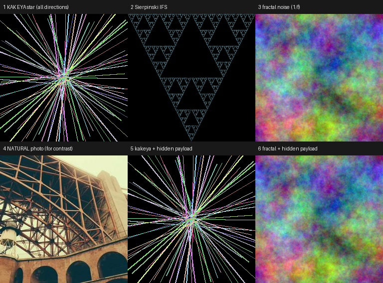

# stego-lab

> An **honest, falsifiable** evaluation harness for image-steganography claims — negative results included.

This repo exists because a common intuition — *"hide data using exotic covers (Kakeya sets, fractals) and it will be harder to detect"* — is testable, and it is **false**. Rather than argue, we measure.

---

## TL;DR

| Claim | Verdict | Evidence |
|---|---|---|
| A synthetic (Kakeya/fractal) cover is **harder to detect** than a natural photo |  **Falsified** | carrier classifier separates them with **AUC = 1.000** |
| Encryption makes the hidden data **harder to detect** |  **False** | payload entropy does not move the AUC (all ≈ 0.99) |
| A tail-append PNG container protects the payload |  **No protection** | blind extraction with zero knowledge recovers plaintext |



*Row 1: Kakeya-style star, Sierpinski IFS, 1/f fractal noise. Row 2: a natural photo, and two covers with a hidden payload — the payload is visually undetectable, but that is the only thing it is.*

---

## Why this exists

The starting point was a small Android app that "hides files inside images". Analysis of its container format and a set of quantitative experiments were used to answer a single question:

> **Can you hide data in a way that a competent adversary cannot detect — or, failing that, cannot extract?**

The answer, measured here, is: **detection is easy, extraction is trivial, and the exotic-cover idea makes things worse, not better.**

### The original container (analyzed)

The app appends a plaintext, self-describing blob after the image bytes:

```
<original image bytes>
|||ENCRYPT_DELIMITER|||
|||FILENAME_DELIMITER|||name.dat|||FILENAME_DELIMITER|||
|||FILE_DELIMITER|||
<raw file bytes>
...
```

No encryption, no key, fixed ASCII magic strings. `demo_crack.py` reproduces the scheme and shows that a **blind extractor** (which knows nothing about the app, only "find the markers") recovers every file. A single `strings` call reveals the structure and the content.

---

## Experiment design (the important part)

### The trap in the naive protocol

A naive test trains **one** detector on a mixed set (natural + synthetic) of covers and stegos, then reports AUC. This measures mostly:

- **(i)** natural-vs-synthetic (carrier realism), not
- **(ii)** clean-vs-stego (embedding detectability).

Because (i) is trivially separable, the naive AUC is ~1 regardless of the embedding, and it tells you *nothing*.

### The fix used here

1. **Per-class detectors.** Train `D_nat` (natural clean vs natural stego) and `D_syn` (synthetic clean vs synthetic stego). Compare their AUCs.
2. **Carrier classifier** `D_carrier` (natural clean vs synthetic clean) — to expose the *free* feature.
3. **Controls** that must come out at AUC ≈ 0.5, otherwise the pipeline is invalid.

---

## Results

### 1. Synthetic vs natural carriers — `experiment.py`

`N = 400` per class, LSB matching @ 0.4 bpp, SPAM-like residual features (588-d) + logistic regression.

| Metric | Value |
|---|---:|
| AUC natural: clean vs stego | 0.9955 |
| AUC synthetic: clean vs stego | 0.9405 |
| **AUC carrier: natural vs synthetic (clean)** | **1.0000** |
| AUC transfer: trained on natural → tested on synthetic | 0.7218 |
| AUC transfer: trained on synthetic → tested on natural | 0.4904 |
| BER after JPEG q70, natural | 0.4997 |
| BER after JPEG q70, synthetic | 0.5003 |

**Reading it correctly:** the 0.9405 < 0.9955 gap is *not* a stealth advantage — it is a feature-response artefact between two different spectra. The decisive number is **carrier AUC = 1.0000**: "this is not a natural photograph" *is itself* the alarm. An adversary separates the carrier first, then applies the matching detector. Both classes lose. And under JPEG q70, both payloads are destroyed (BER ≈ 0.5 = chance).

### 2. Does encrypting the payload hide it better? — `payload_entropy.py`

Same covers, same embedding positions, same method. Only the payload bits differ.

| Payload | AUC |
|---|---:|
| random bits (≈ ciphertext) | 0.9933 |
| structured text | 0.9965 |
| all-zero | 0.9986 |

**Encryption is orthogonal to detectability.** Detection targets the *embedding operation*, not the payload. The encrypted (random) payload is the least detectable of the three — and still detected.

### 3. Sanity controls — `validate.py`

| Control | AUC | Expected |
|---|---:|---|
| rate = 0 (image untouched) | 0.5000 | ≈ 0.50 |
| clean-half vs clean-half | 0.4739 | ≈ 0.50 |
| shuffled pairing (clean) | 0.4843 | ≈ 0.50 |

All three ≈ 0.5 ⇒ no leakage, no label bug, no systematic artefact in the pipeline.

### 4. Embedding-rate sweep — `validate.py`

| rate (bpp) | AUC |
|---:|---:|
| 0.00 | 0.5000 |
| 0.02 | 0.7226 |
| 0.05 | 0.8466 |
| 0.10 | 0.9452 |
| 0.20 | 0.9890 |
| 0.40 | 0.9922 |

A textbook monotone steganalysis curve: starts at 0.5 with no embedding and rises smoothly. **Detection is already strong at 0.1 bpp** — "just embed less" does not rescue LSB matching.

---

## Reproduce

```bash
pip install -r requirements.txt

python3 experiment.py      # pilot-1: synthetic vs natural carriers
python3 validate.py        # controls + embedding-rate sweep
python3 payload_entropy.py # does payload entropy change detectability?
python3 demo_crack.py      # faithful re-implementation of the tail-append container + blind crack
python3 preview.py         # render the cover montage
```

Natural covers are fetched on first run from Lorem Picsum into `natural/` (not committed).

---

## Limitations (honest list)

- One embedder (LSB matching), one feature family (SPAM-like), linear classifier. A CNN (e.g. SRNet) would push both per-class AUCs toward 1 — strengthening, not overturning, the conclusion.
- Natural covers arrive as JPEG (Picsum); synthetic covers are generated losslessly. Acquisition pipelines are not matched yet. This affects the precision of the *within-class* comparison; the carrier AUC = 1.0 result is only made stronger by it.
- Single split, single seed. k-fold + multiple seeds should be added for real confidence intervals.
- The synthetic generators are our choice; a "more natural-looking" generator would be less synthetic — at which point it stops being a Kakeya/fractal and becomes just another natural-looking image.

---

## What actually works (roadmap)

The productive directions are the ones this repo points *at*, not the ones it debunks:

1. **Encrypt-then-embed**: `Argon2/PBKDF2 → AES-GCM` for confidentiality, then embed the *ciphertext* into a **natural** cover with a matching/robust embedder. Encryption buys "even if extracted, unreadable"; it does not buy detectability.
2. **Learned robust watermarking / steganography** (e.g. HiDDeN, StegaStamp, TrustMark, MBRS, Stable Signature) for the robustness axis.
3. **Coverless steganography** with a keyed generative mapping — evaluated, as here, against a properly-designed adversary.

---

## License

CC BY-NC-SA 4.0 — **non-commercial use only. 禁止商用。** See [LICENSE](LICENSE).

---

## 中文摘要 / Chinese summary

本仓库是「尾部追加容器 + 实测对照」的工程与实验记录：

- `stegobox.py` —— 简易尾部追加容器（AES-GCM 加密、SHA-256 完整性校验）
- `experiment.py` / `validate.py` / `stats.py` / `payload_entropy.py` —— 隐写可检测性实验（对照组、嵌入率扫描、多种子重复划分、学习曲线）
- `scramble_demo.py` / `chaos_reversibility.py` / `bitdepth_capacity.py` —— 对「置换加密 / 混沌可逆性 / 位深提容量」等直觉的实测反驳
- `results/` —— 全部实测数字

**核心结论**：奇异的数学载体（挂谷集 / 分形 / 置乱 / 混沌）并不能提高隐写的安全性；
加密与「可检测性」是正交的两件事 —— 加密只保证「被拆出来也看不懂」。

---

## License / 协议

**CC BY-NC-SA 4.0 — non-commercial use only. 禁止商用。**

完整条款见 [LICENSE](LICENSE)。
